# How to assemble the hardware

This project is based on cheap and easy to assemble hardware, namely the wemos nodes. The modules are available online: [wemos.cc](https://www.wemos.cc).

## The modules and pins

We are using four modules which can be stacked together (left to right):

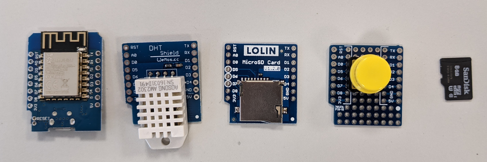 

1. The D1 which is basically the esp8266 board (very left). Different versions are available. The depicted one is the *D1 mini*. [Overview of D1 modules](https://www.wemos.cc/en/latest/d1/index.html)

2. The Sensor shield. Here, we are using the DHT shield which is equipped with an AM2320 sensor. [DHT Shield](https://www.wemos.cc/en/latest/d1/index.html)

3. A micro SD card shield. [MicroSD card shield](https://www.wemos.cc/en/latest/d1_mini_shield/micro_sd.html)

4. A button shield. The one in this documentations looks slightly different to the ones in the Internet. The functionality is the same. [Button shield](https://www.wemos.cc/en/latest/d1_mini_shield/1_button.html)

5. For the SD card shield, an SD card is required.

The nodes are soldered completely. Only the pins have to be soldered as the type of pins depend on the application scenario. Three types of pins are available:

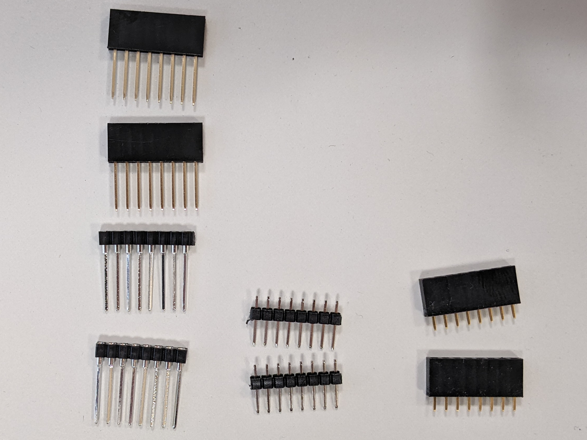

1. The pins on the very left side of the picture are connected through the PCB, i.e. the PCBs can be stacked. Here, different types and qualities are available.

2. The *normal* pins (as the ones in the center) can only connect to the lower part. This type is used only for the button -- it does not make sense to stack something above the button!

3. The right shows the socket. This can be used for the most bottom shield as in our case the sensor shield. We decided to use the connect through pins to simplify further adaptations.

## How to assemble the hardware

In general, three important things have to be considered when assembling the hardware:

- **Correct alignment**: Make sure that the PCBs are not rotated, i.e., TX, RST, 3V3 and 5V are always on the same corners of the PCB even after stacking!
- **Correct angle of the pins** (90 degrees to the PCB). To properly stack the PCBs, the pins have to be aligned properly. Otherwise, the contact might not work as expected and the PCBs might break.
- **Good soldering** - especially for the SD card. Otherwise, connection errors can occur.

# Step by step: Soldering

## 1: Solder the button shield

The button shield is the most top one. Therefore, I used the normal pins as shown in the next picture. I used the SD card shield for alignment reasons only: Using this trick, the pins are connected in a 90 degrees angle to the button PCB. **Only solder the button PCB and not the SD PCB yet!**.

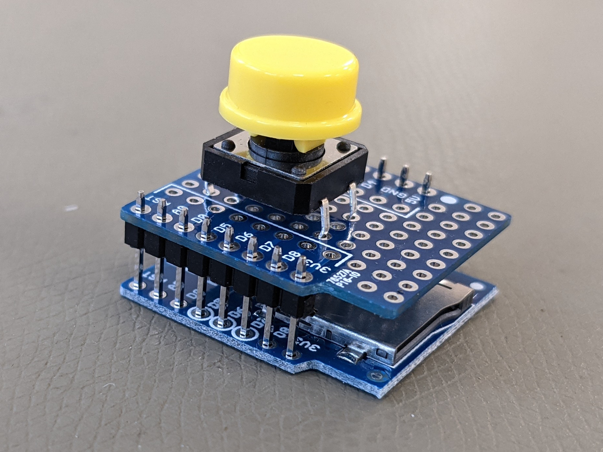

After the soldering, the button shield should look like in the following picture:
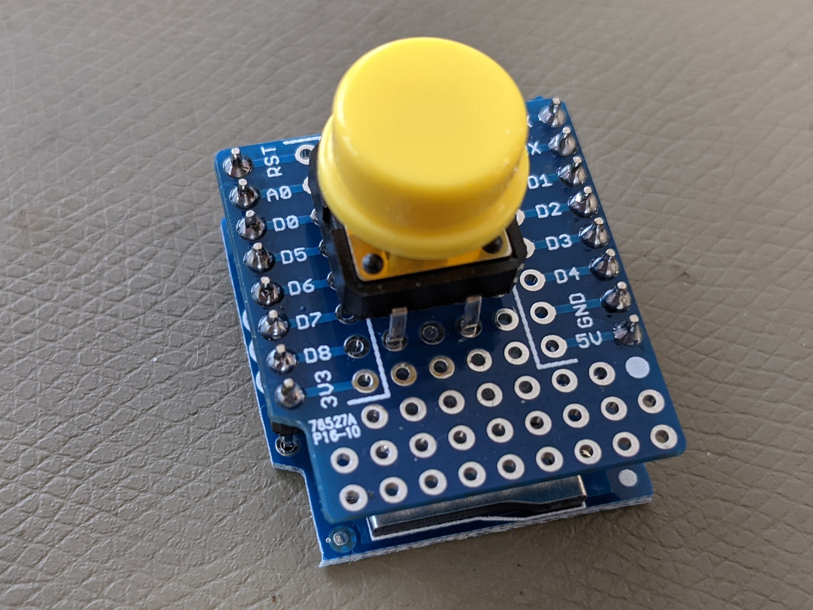

Now, the supporting SD card shield can be removed and you are done with soldering the first shield:

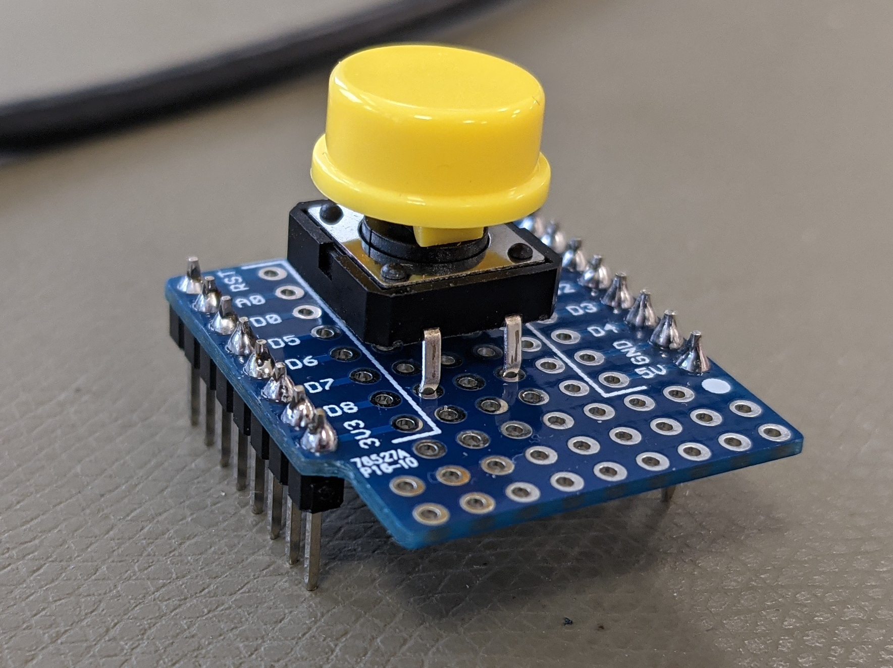

## 2: Solder the D1

In this step, we will solder the D1, i.e. the microcontroller. For that, we will use the button shield as a support and use the long connect-through headers. First, we connect the long pins to the button shield:

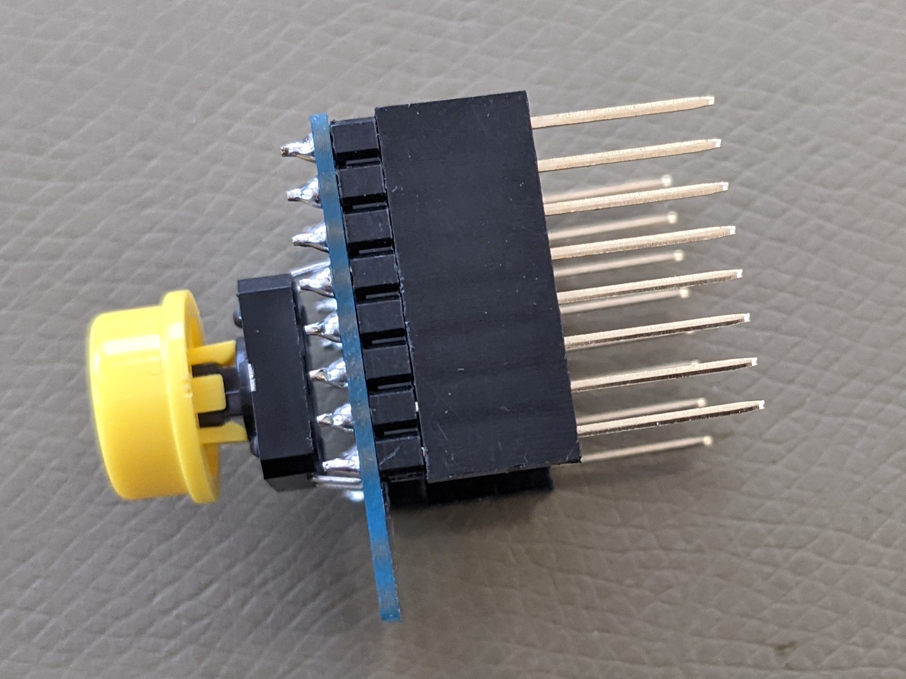

Next, we place the D1 on these headers and carefully check the correct alignment of the pins (3V3 over 3V3, RST over RST etc.):

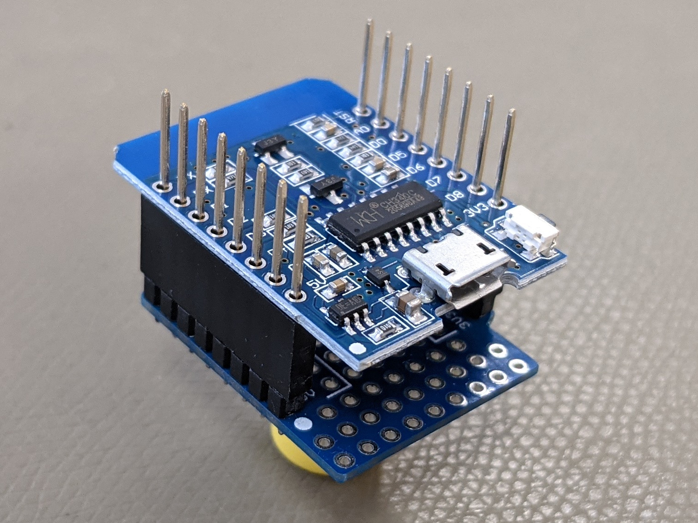

After soldering the pins, we can remove the D1 from the button shield:

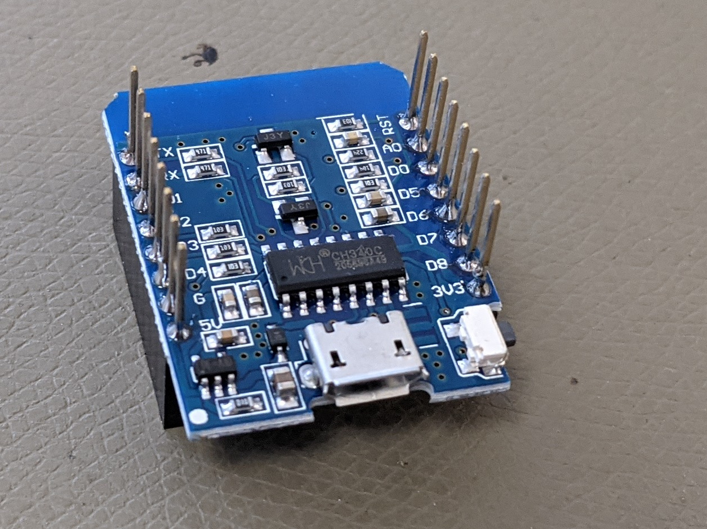

##  3: Solder the SD card shield

The steps for the SD card shield are basically the same as for the D1 shield. The result is depicted in the following picture:

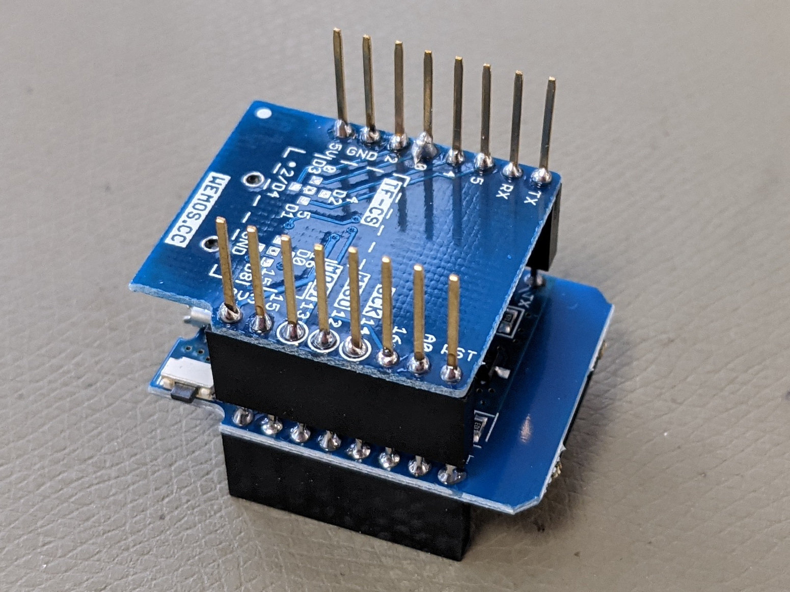

## 4: Solder the sensor shield

The sensor shield is also soldered similar to the SD and the D1 shield and should look as follows (not yet soldered in the picture):

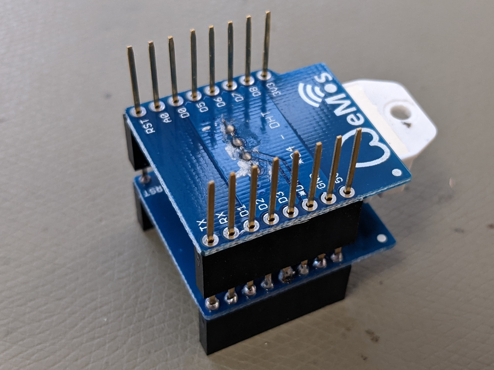

## Checking and stacking the nodes together

Now you should have the following four shields with pins connected:

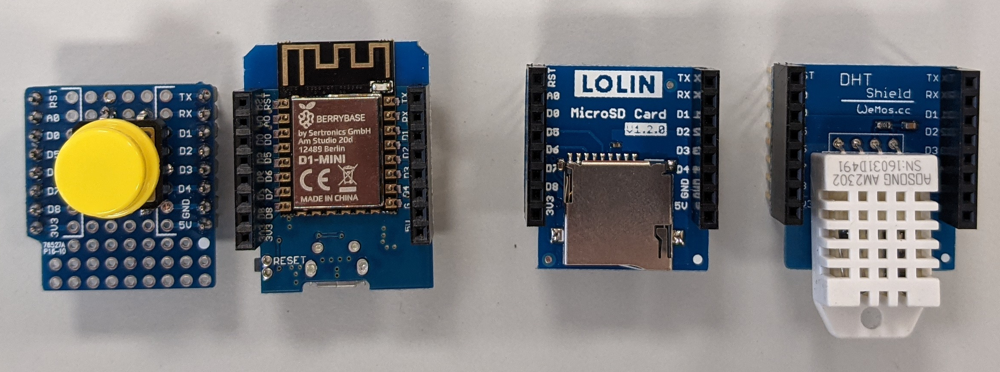

In general, there are several ways of stacking everything together. You should not change the stacking too often, as the connection of the pins decreases from time to time. This leads to SD or sensor errors. I prefer the following order to prevent the CPU from heating up the temperature sensor:

1. Button
2. D1 microcontroller
3. SD card
4. DHT / sensor shield

The stack should look as follows:

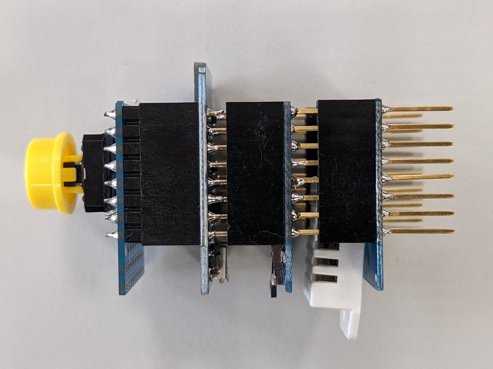
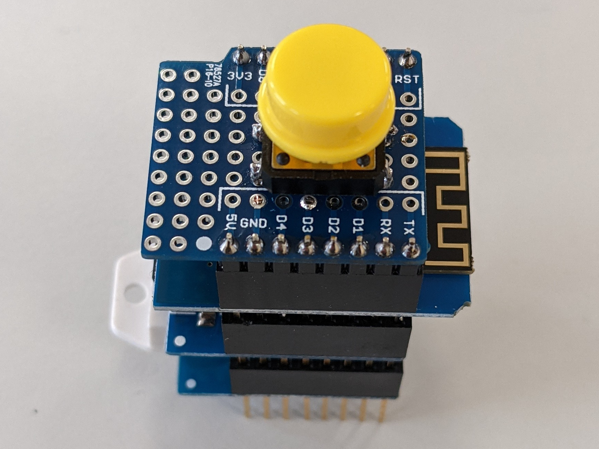

Congratulation. You are done.

# CS Pin for SD card

Some of the SD card shields have different pins for the chip select (SS, CS). For this project, the CS pin has to be GPIO15 (D8).

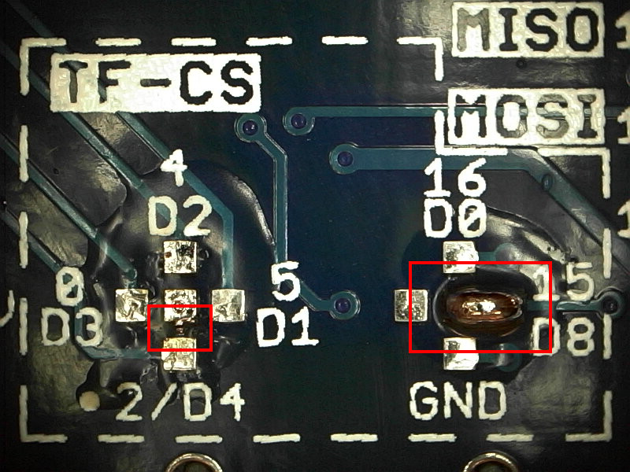

On this shield, the connection to GPIO2 (D4) was cut using a sharp knife (left red rectangle) and GPIO15 (D8) was connected by soldering the two taps (right red rectangle).

# Which pin is used for which function?

The following table gives a brief overview of the pins and their function.

|Pin|Function|ESP-8266 Pin|Shield|Comment|
|--|--|--|--|--|
|TX|TXD|TXD||Do not use|
|RX|RXD|RXD||Do not use|
|A0|Analog input, max 3.2V|A0|||
|D0|IO|GPIO16||Wake pin, connect to RST for Deep Sleep|
|D1|IO, SCL|GPIO5||I²C, future use|
|D2|IO, SDA|GPIO4||I²C, future use|
|D3|IO, 10k Pull-up|GPIO0|Button||
|D4|IO, 10k Pull-up, BUILTIN_LED|GPIO2|DHT| internal LED connected|
|D5|IO, SCK|GPIO14|SD||
|D6|IO, MISO|GPIO12|SD||
|D7|IO, MOSI|GPIO13|SD||
|D8|IO, 10k Pull-down, SS|GPIO15|SD_CS|Check, differs between shields|
|G|Ground|GND|||
|5V|5V|-|||
|3V3|3.3V|3.3V|||
|RST|Reset|RST|||

